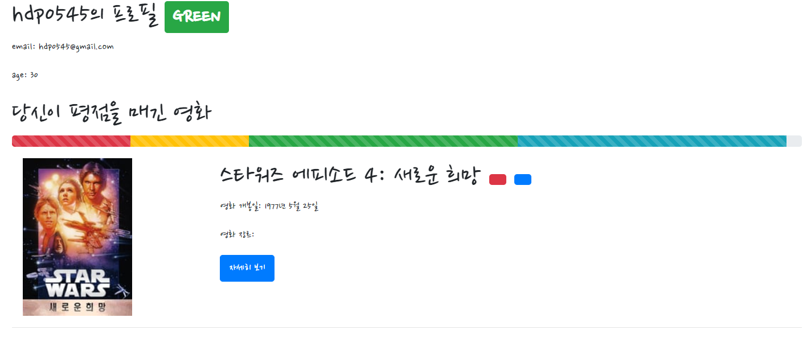
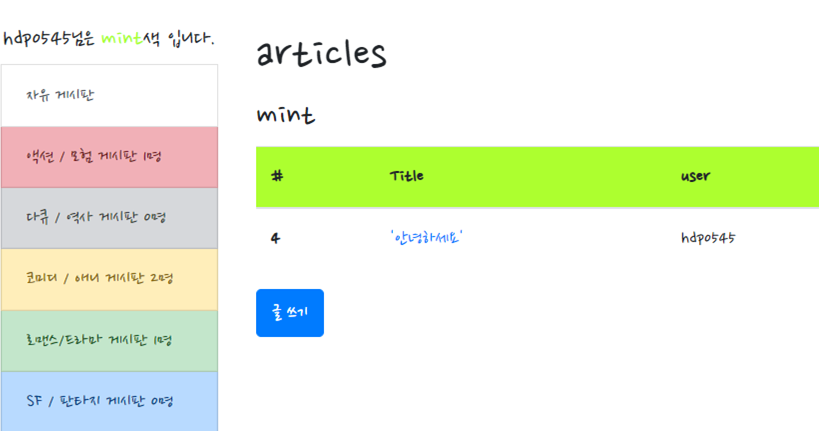
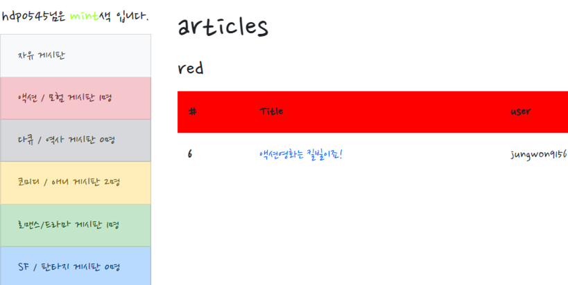
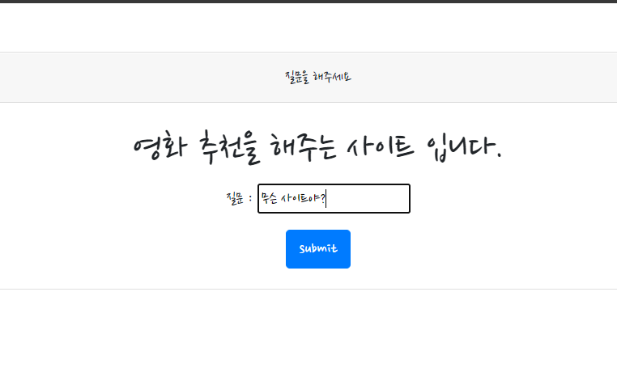
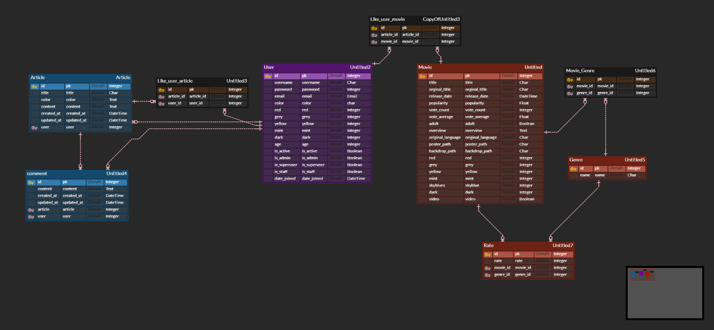

# What`s Your Color?

안녕하십니까? What`s your Color의 개발자 홍두표 라고 합니다.

영화 관람 후, 친구들과 재밌는 영화에 대해 이야기를 나누면서 즐거움이 배가 되었던 경험이 있으신가요? 저희 원두팀의 What`s your color에선 **자신의 영화 취향을 알아주는 친구들**과 함께 영화에 대해 이야기를 나누고 이를 공유할 수 있습니다.

### 1. 구현 목표

저희 팀의 구현 목표는 '비슷한 취향을 지닌 사람들끼리 모여서 놀고 경쟁할 수 있는 커뮤니티를 만들어 주자'입니다.

이러한 홈페이지를 만들게 된 계기는 한동안 저희 반에서 논란이 되었던 민트초코라는 마이너한 취향에서 영향을 받았습니다. 마침 저와 팀장인 정원이가 민초단이었어서 3반에서 배척을 받은 경험이 있습니다. 이런 경험을 통해 취향이 비슷한 친구들과 떠들 수 있는 공간이 필요하다! 라는 것을 느꼈습니다.

### 2. 구현 방법

##### user

저희 원두 팀은 각각의 장르를 6가지 색으로 분류하여 대표되는 색깔을 정하고 이를 영화 추천 및 커뮤니티를 구현하는데 사용하였습니다. 영화에 평점을 매길 때 마다,  높은 평점을 준 영화의 색에 물들고 낮은 평점을 준 영화의 색이 빠지면서 확고한 자신의 색깔이 정해지는 것이죠.

이는 프로필 페이지를 통해 자신의 색을 바로바로 확인하고 그래프로 자신에게 영향을 주고 있는 색을 확인 할 수 있게 하여 구현하였습니다.




##### community

이렇게 정해진 자신의 색깔은 커뮤니티에서 활용됩니다. 각각 영화취향이 맞는 친구들끼리 대화할 수 있는 공간을 마련하였습니다. 글쓰기는 앞서 결정된 자신의 색깔에 해당하는 게시판에서만 작성할 수 있으며, 댓글은 모든 공간에서 작성가능합니다.





##### movies

저희의 주제처럼 영화추천 알고리즘 또한 색깔에 초점을 두어 추천을 하였습니다. 만약 제가 빨강색 영화에 높은 평점을 주었다면 빨간색 영화에 높은 가중치를 주게 됩니다. 따라서 빨간색 영화를 우선적으로 추천하게 됩니다. 

```python
def recommend(request, username):
    bootstrap_color = {
        'red': 'danger',
        'grey': 'secondary',
        'yellow': 'warning',
        'mint': 'success',
        'skyblue': 'primary',
        'dark': 'dark'
    }
    user = get_object_or_404(get_user_model(), username=username)
    movies = Movie.objects.filter(~Q(like_users=user))
    user_color = dict()
    user_color['red'] = user.red
    user_color['grey'] = user.grey
    user_color['yellow'] = user.yellow
    user_color['mint'] = user.mint
    user_color['skyblue'] = user.skyblue
    user_color['dark'] = user.dark
    sorted_user = sorted(user_color.items(), key = (lambda x: x[1]), reverse=True)
    recommend_list = []
    for i in range(3):
        recommend = dict()
        if sorted_user[i][0] == 'mint':
            first_movies = movies.filter(mint=1)[:6]
            second_movies = movies.filter(mint=1)[6:12]
            recommend['ment'] = '두근두근 콩닥콩닥 당신의 연애세포를 깨울 영화!'
        elif sorted_user[i][0] == 'red':
            first_movies = movies.filter(red=1)[:6]
            second_movies = movies.filter(red=1)[6:12]
            recommend['ment'] = '화끈한 액션! 짜릿한 모험! 스트레스 타파!!'
        elif sorted_user[i][0] == 'grey':
            first_movies = movies.filter(grey=1)[:6]
            second_movies = movies.filter(grey=1)[6:12]
            recommend['ment'] = '영화로 배우는 역사! 그때 그 시절 속으로~'
        elif sorted_user[i][0] == 'yellow':
            first_movies = movies.filter(yellow=1)[:6]
            second_movies = movies.filter(yellow=1)[6:12]
            recommend['ment'] = '감성적인 그대에게 띄우는 영화'
        elif sorted_user[i][0] == 'skyblue':
            first_movies = movies.filter(skyblue=1)[:6]
            second_movies = movies.filter(skyblue=1)[6:12]
            recommend['ment'] = '당신의 상상력을 만족시킬 영화!'
        elif sorted_user[i][0] == 'dark':
            first_movies = movies.filter(dark=1)[:6]
            second_movies = movies.filter(dark=1)[6:12]
            recommend['ment'] = '팬티는 챙기셨죠? 당신의 이불을 적실 영화!'
        recommend['first_movies'] = first_movies
        recommend['second_movies'] = second_movies
        recommend['bg'] = bootstrap_color[sorted_user[i][0]]
        
        
        recommend_list.append(recommend)
    

    context = {
        'recommend_list': recommend_list
    }
    return render(request, 'movies/recommend.html', context)
```

##### IBM assistant

마지막으로  편의 기능입니다. 자주 묻는 질문들을 IBM assistant를 활용하여 정리해 두었습니다. 

만약 사이트에 대한 기능이 궁금하다면  text의 형태로 이를 인풋창에 입력합니다. 그러면 IBM assistant의 자연어 분석시스템을 활용하여 준비된 대답을 대답합니다.




##### Model의 ERD 구조


